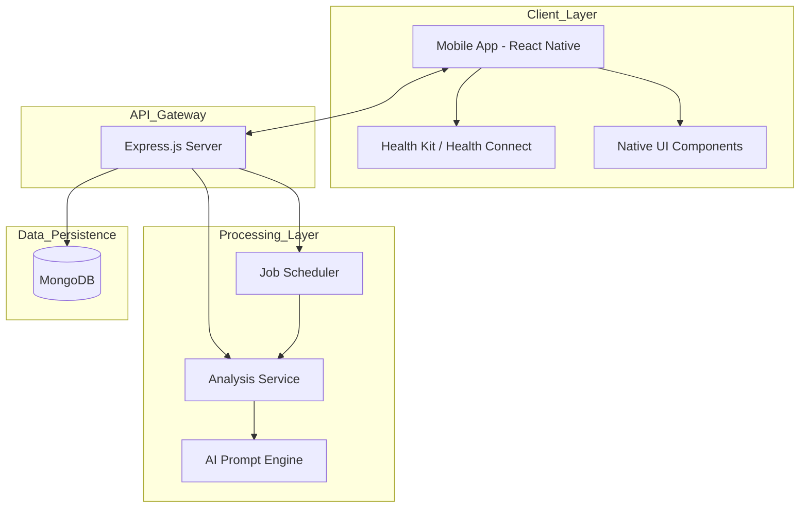
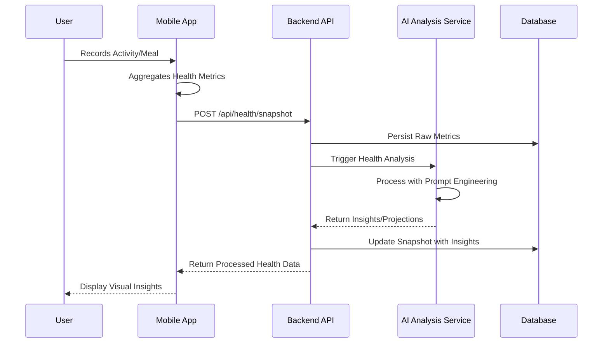
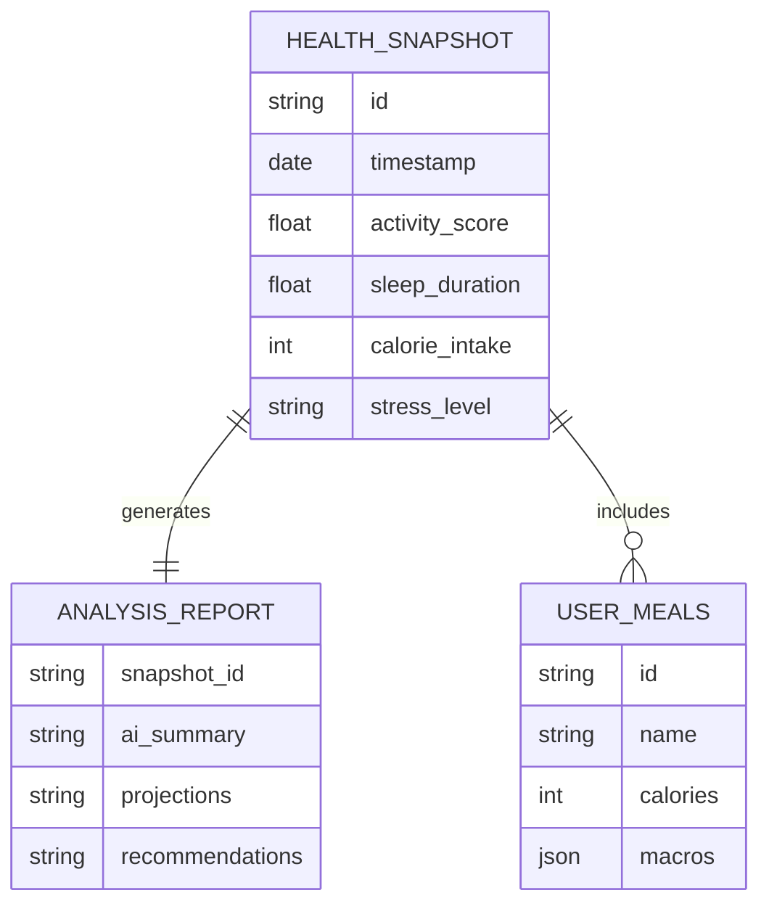

# LumaLife
### AI-Powered Holistic Wellness and Health Analytics Platform


LumaLife is a comprehensive health management ecosystem designed to bridge the gap between raw biometric data and actionable wellness insights. By integrating mobile health telemetry with advanced backend analysis, it transforms daily activity, sleep, and nutrition metrics into long-term health projections.

---

## Visual Diagrams

### System Architecture


### Data Flow Sequence


### Entity Relationship Diagram


---

## Problem Statement
Most health tracking applications suffer from "data siloing" and "metric fatigue." Users are presented with raw numbers (steps, hours slept, calories) but lack the context to understand how these metrics correlate or what they predict for future well-being. This gap leads to a lack of sustained motivation and an inability to make meaningful lifestyle adjustments based on objective data.

---

## Solution Overview
LumaLife solves this by implementing a centralized health "Snapshot" system. It pulls data from native mobile health providers, combines it with manual nutrition logging, and sends this unified data to a Node.js backend. The backend utilizes specialized AI prompts to analyze the data, providing users with qualitative insights and quantitative projections that help them understand the long-term impact of their current habits.

---

## Key Features
- **Biometric Integration**: Seamlessly fetches activity and sleep data using native health permissions.
- **AI Health Insights**: Backend analysis engine that generates personalized wellness recommendations.
- **Future Projections**: Visualizes potential health outcomes based on current lifestyle trends.
- **Nutrition Tracking**: Detailed meal logging interface with macro-nutrient breakdowns.
- **Holistic Dashboard**: Unified view of stress, sleep, activity, and nutrition.
- **Automated Background Jobs**: Periodic analysis of historical health data to detect patterns.

---

## Tech Stack

| Category | Technology | Purpose |
| :--- | :--- | :--- |
| Frontend | React Native (Expo) | Cross-platform mobile application development |
| Backend | Node.js (Express) | RESTful API and business logic orchestration |
| Database | MongoDB | Flexible document storage for health snapshots |
| Styling | NativeWind (Tailwind) | Utility-first styling for mobile interfaces |
| Language | TypeScript / JavaScript | Type-safe frontend and flexible backend logic |
| AI Integration | Custom Prompt Engine | Logic for processing health data into insights |

---

## Quick Start / Installation

### Prerequisites
- Node.js (v18+)
- MongoDB instance (Local or Atlas)
- Expo Go app on a mobile device (for testing frontend)

### Backend Setup
1. Navigate to the backend directory:
   ```bash
   cd backend
   ```
2. Install dependencies:
   ```bash
   npm install
   ```
3. Configure environment variables in a `.env` file.
4. Start the server:
   ```bash
   npm run dev
   ```

### Frontend Setup
1. Navigate to the frontend directory:
   ```bash
   cd frontend
   ```
2. Install dependencies:
   ```bash
   npm install
   ```
3. Start the Expo development server:
   ```bash
   npx expo start
   ```

---

## Environment Variables

| Variable | Description | Example | Required |
| :--- | :--- | :--- | :--- |
| `PORT` | Backend server port | `3000` | Yes |
| `MONGO_URI` | Connection string for MongoDB | `mongodb://localhost:27017/lumalife` | Yes |
| `AI_API_KEY` | Key for health analysis services | `sk_...` | Yes |
| `EXPO_PUBLIC_API_URL` | Frontend pointer to backend | `http://192.168.1.5:3000` | Yes |

---

## API Endpoints

| Method | Endpoint | Description | Auth |
| :--- | :--- | :--- | :--- |
| `POST` | `/api/health/snapshot` | Submit daily health metrics for analysis | No |
| `GET` | `/api/health/insights` | Retrieve AI-generated wellness reports | No |
| `POST` | `/api/health/meals` | Log a new meal with nutritional data | No |
| `GET` | `/api/health/projections`| Fetch long-term health trend predictions | No |

### Example Request (Submit Snapshot)
```bash
curl -X POST http://localhost:3000/api/health/snapshot \
-H "Content-Type: application/json" \
-d '{
  "steps": 12000,
  "sleepHours": 7.5,
  "stressLevel": "low",
  "caloriesConsumed": 2100
}'
```

---

## Project Structure

```text
.
├── backend
│   ├── src
│   │   ├── controllers    # Request handlers
│   │   ├── jobs           # Background analysis tasks
│   │   ├── models         # Mongoose schemas
│   │   ├── prompts        # AI logic and templates
│   │   ├── routes         # API endpoint definitions
│   │   └── services       # Business logic (AI processing)
│   └── index.js           # Server entry point
├── frontend
│   ├── app                # Expo Router pages and layouts
│   ├── assets             # Images and local data
│   ├── components         # Reusable UI elements
│   └── lib                # Health SDK integrations and API wrappers
└── todo                   # Project roadmap
```

---

## Deployment & Architecture Decisions

- **Architecture**: A decoupled Monorepo structure was chosen to ensure the frontend and backend could be scaled independently while sharing a single source of truth for documentation and tracking.
- **Hosting**: The backend is designed for containerized deployment (e.g., Docker) on platforms like AWS ECS or Heroku to handle fluctuating API loads during user sync events.
- **Database Choice**: MongoDB was selected because health data formats vary significantly between devices (Apple Health vs. Google Fit); a schema-less approach allows for flexible metric ingestion.

---

## Technical Challenges & Solutions

### Challenge 1: Native Health Permission Orchestration
**Problem**: Managing asynchronous permission requests for multiple health metrics (steps, heart rate, sleep) across different OS versions.
**Solution**: Implemented a centralized `healthPermissions.ts` utility that wraps native modules in a standard Promise-based interface, ensuring the app state remains consistent even if a user denies partial permissions.

### Challenge 2: Contextual AI Analysis
**Problem**: Generic LLM responses often lack the clinical context needed for health data.
**Solution**: Created a structured `healthPrompts.js` system that transforms raw JSON snapshots into highly specific natural language templates before processing, ensuring consistent and medically-relevant insights.

---

## Development Commands

- `npm run dev`: Starts the backend with nodemon for hot reloading.
- `npx expo start`: Launches the frontend development environment.
- `npm run lint`: Checks for code style issues in both packages.
- `npx eas build`: Packages the frontend for production distribution.

---

## Testing Approach

- **Current State**: Manual testing of API endpoints via Postman and frontend testing via Expo Go on physical devices.
- **Future Plans**:
  - Implementation of Jest for unit testing backend services.
  - Integration of Detox for end-to-end mobile testing.
  - CI/CD pipelines to validate health data processing logic on every push.

---

## Contributing Guidelines
Contributions are welcome. If you have ideas for better health visualization or more accurate AI analysis models, please fork the repository and submit a pull request. We value clean code and well-documented logic.

---

## License
Distributed under the MIT License. See `LICENSE` for more information.

---

**Built by [Tanmay Aggarwal](https://github.com/TanmayAggarwal87)**

--made by [docify](https://docify-two.vercel.app/)--
